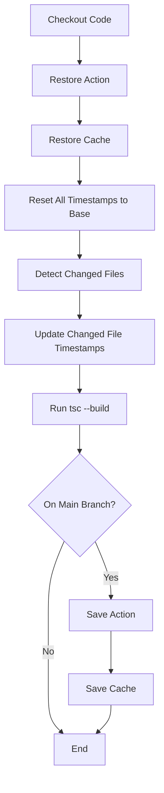
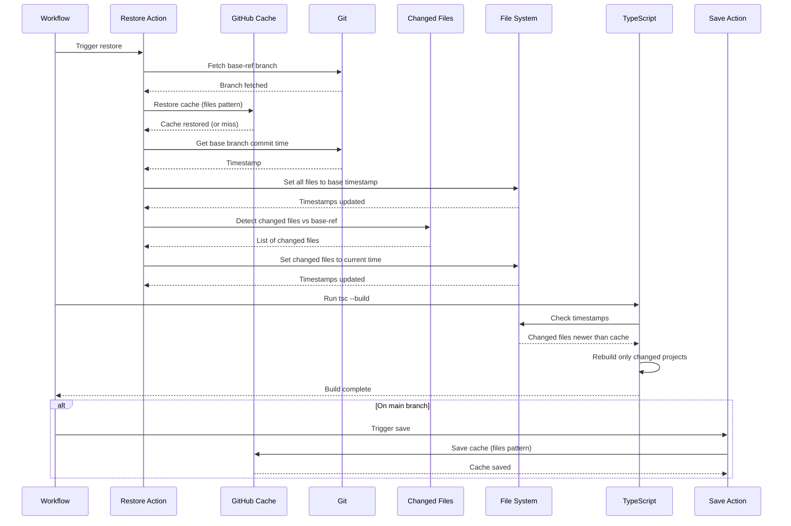
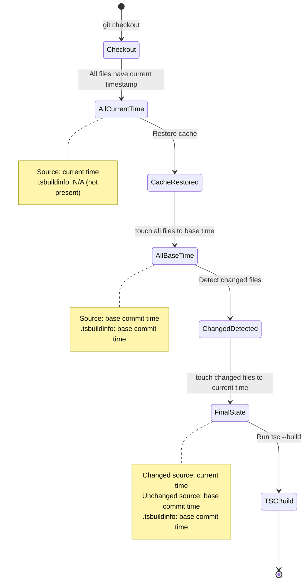
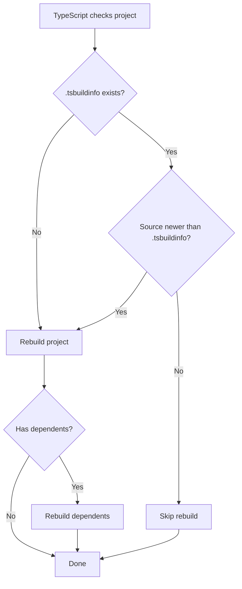
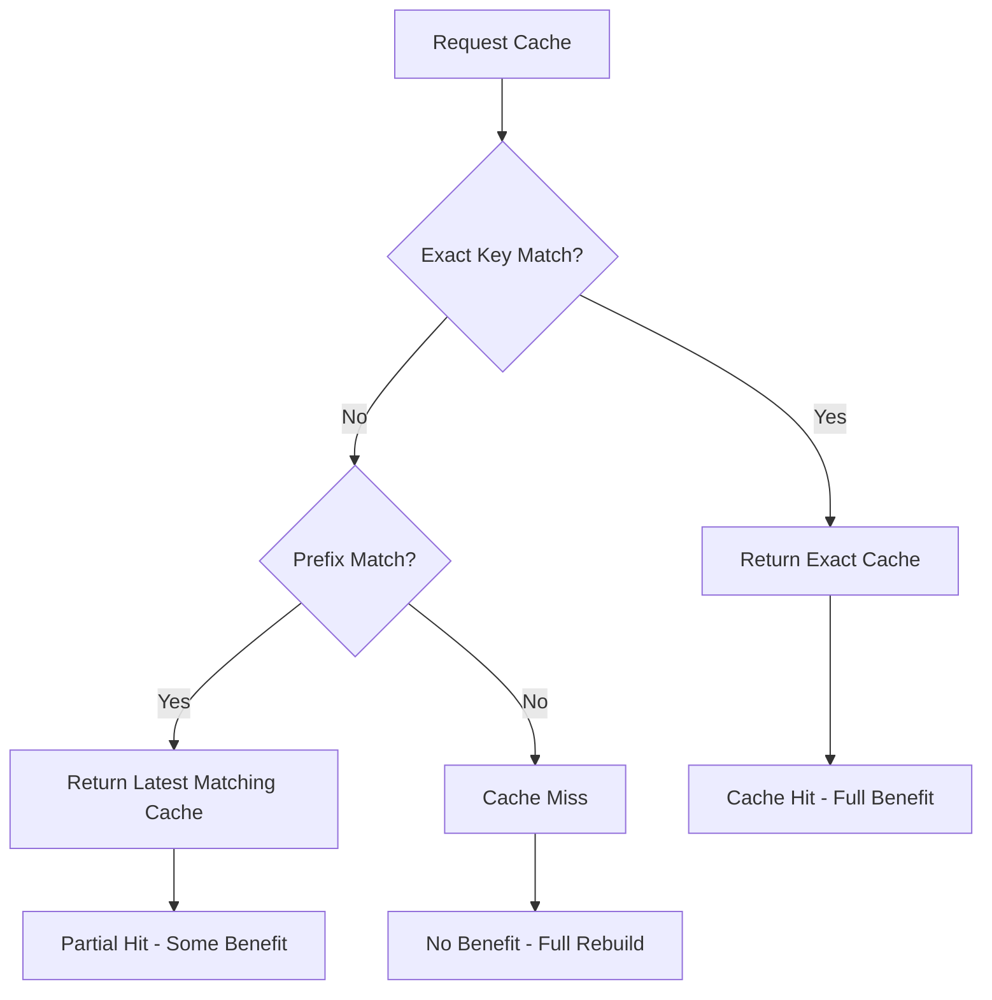
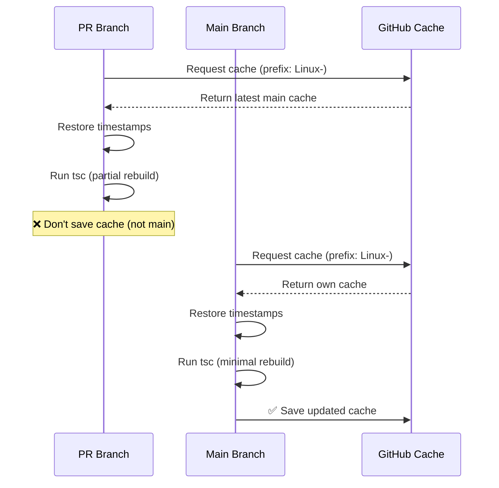
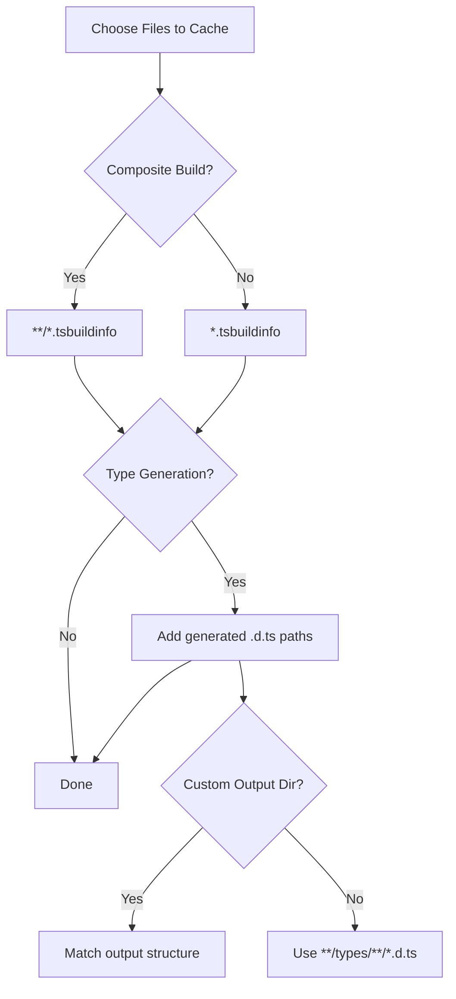
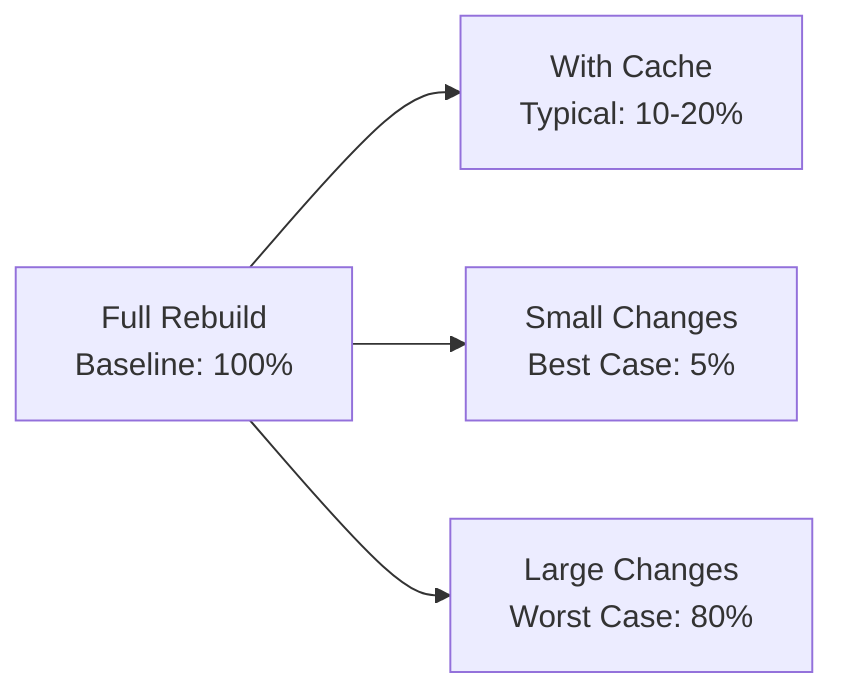
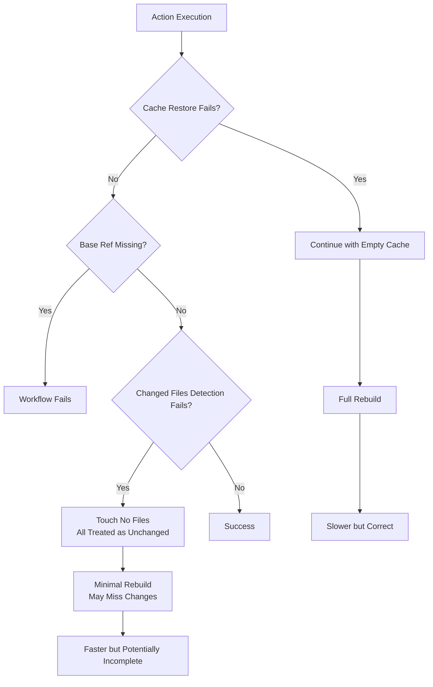
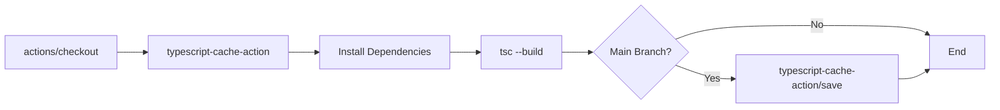

# Architecture Documentation

## Overview

`typescript-cache-action` is a **composite GitHub Action** that solves incremental TypeScript builds in CI by managing build artifact caching and file timestamp restoration.

## Core Problem Statement

TypeScript's `tsc --build` mode uses file modification timestamps to determine what needs rebuilding:
- If source files are newer than `.tsbuildinfo`, rebuild that project
- If `.tsbuildinfo` doesn't exist, rebuild everything
- If source files are older than `.tsbuildinfo`, skip rebuild

**Challenge**: Git doesn't preserve file timestamps. On checkout, all files get the current timestamp, causing TypeScript to rebuild everything every time.

## Solution Architecture

### High-Level Flow



### Detailed Workflow



## Component Architecture

### 1. Main Action (`action.yml`)

**Purpose**: Restore cached build artifacts and prepare file system for incremental build

**Inputs**:
```yaml
cache-base-key: string   # OS or other stable prefix
cache-key: string        # Unique key (usually commit SHA)
base-ref: string         # Branch to compare against (default: main)
files: string            # Glob patterns for TS output files
```

**Steps**:

#### Step 1: Fetch Base Reference
```yaml
- name: get ref
  shell: bash
  run: git fetch origin ${{ inputs.base-ref }}:${{ inputs.base-ref }}
```

**Why**: Ensures base branch exists locally for comparison and timestamp extraction.

#### Step 2: Restore Cache
```yaml
- name: restore tsc build cache
  uses: actions/cache/restore@v4
  with:
    path: ${{ inputs.files }}
    key: ${{ inputs.cache-base-key }}-${{ inputs.cache-key }}
    restore-keys: |
      ${{ inputs.cache-base-key }}-${{ inputs.cache-key }}
      ${{ inputs.cache-base-key }}
```

**Cache Strategy**:
1. Exact match: `{base-key}-{commit-sha}` (ideal)
2. Prefix match: `{base-key}-*` (fallback to recent cache)

**Files Cached**:
- `.tsbuildinfo` - TypeScript incremental build metadata
- Generated `.d.ts` - Type definition files

#### Step 3: Reset All Timestamps
```yaml
- name: restore timestamps of all files to base branch commit
  shell: bash
  run: |
    find . -type f \
      -exec touch -c -m -t $(git log -1 --format=%cd --date=format:%y%m%d%H%M.%S ${{ inputs.base-ref }}) {} +
```

**Purpose**: Set every file's modification time to base branch HEAD commit time.

**Result**:
- All source files: base commit timestamp
- All cached `.tsbuildinfo`: base commit timestamp (from cache)
- All files appear "unchanged" to TypeScript

#### Step 4: Detect Changed Files
```yaml
- name: changed source files
  uses: tj-actions/changed-files@v45
  id: changed-source-files
  with:
    base_sha: ${{ inputs.base-ref }}
```

**Output**: Space-separated list of files changed between current HEAD and base-ref

#### Step 5: Update Changed File Timestamps
```yaml
- name: restore timestamps to source files with head ref timestamp
  if: steps.changed-source-files.outputs.any_changed == 'true'
  shell: bash
  run: touch -c -m ${{ steps.changed-source-files.outputs.all_changed_files }}
```

**Purpose**: Mark changed files as "newer" by setting to current time.

**Result**:
- Changed source files: current timestamp (newer than `.tsbuildinfo`)
- Unchanged source files: base commit timestamp (same as `.tsbuildinfo`)

### 2. Save Action (`save/action.yml`)

**Purpose**: Save updated build artifacts to cache

**Inputs**:
```yaml
cache-base-key: string   # Same as restore
cache-key: string        # Same as restore
files: string            # Same as restore
```

**Steps**:

#### Save Cache
```yaml
- name: save tsc build cache
  uses: actions/cache/save@v4
  with:
    path: ${{ inputs.files }}
    key: ${{ inputs.cache-base-key }}-${{ inputs.cache-key }}
```

**When to Run**: Only on default branch (main/master) to avoid cache pollution from feature branches.

## Timestamp State Machine



### TypeScript's Decision Logic



**With Proper Timestamps**:
- Unchanged files: base time = `.tsbuildinfo` time → Skip ✅
- Changed files: current time > `.tsbuildinfo` time → Rebuild ✅

**Without Action** (all files current time):
- All files: current time > `.tsbuildinfo` time → Rebuild everything ❌

## Cache Strategy

### Cache Key Design

```
{cache-base-key}-{cache-key}
```

**Example**:
```
Linux-abc123def456  # Exact commit cache
Linux-              # Prefix fallback
```

### Cache Hierarchy



### Cache Lifecycle



**Benefits**:
- PR builds get speed boost from main cache
- Only main branch saves cache (stable, trusted)
- Cache can't be poisoned by PR branches

## File Pattern Matching

### Common Patterns

```yaml
files: |
  **/*.tsbuildinfo           # All incremental build files
  **/types/**/*.d.ts         # Generated types in types/ dirs
  dist/**/*.d.ts             # Built types in dist/
  build/**/*.d.ts            # Built types in build/
```

### Pattern Selection



## Dependencies

### External Actions

```mermaid
graph LR
    A[typescript-cache-action] --> B[actions/cache/restore@v4]
    A --> C[actions/cache/save@v4]
    A --> D[tj-actions/changed-files@v45]

    B --> E[GitHub Cache API]
    C --> E
    D --> F[Git Diff]
```

**Dependency Tree**:
- `actions/cache/*` - Official GitHub caching actions
  - Handles cache storage/retrieval
  - Manages cache keys and fallbacks
  - Platform-agnostic

- `tj-actions/changed-files` - File change detection
  - Compares commits efficiently
  - Handles renames and moves
  - Outputs in consumable format

### System Dependencies

- **Git**: Required for branch operations and change detection
- **Bash**: Shell for composite action steps
- **find**: File traversal for timestamp updates
- **touch**: Timestamp modification

## Performance Characteristics

### Time Complexity

**Cache Operations**:
- Restore: O(n) where n = number of cached files
- Save: O(n) where n = number of cached files

**Timestamp Operations**:
- Reset all: O(m) where m = total files in repo
- Update changed: O(c) where c = number of changed files

**TypeScript Build**:
- No cache: O(p) where p = all projects
- With cache: O(k) where k = changed projects + dependents

### Space Complexity

**Cache Size**:
```
Size = Σ(tsbuildinfo files) + Σ(generated .d.ts files)
```

**Typical Sizes**:
- Small project: ~1-10 MB
- Medium monorepo: ~10-100 MB
- Large monorepo: ~100-500 MB

**GitHub Limits**:
- Max cache size per entry: 10 GB
- Max total cache size per repo: 10 GB
- Caches auto-expire after 7 days of no access

### Performance Gains



**Factors Affecting Performance**:
1. **Cache Hit Rate**: Higher = better performance
2. **Change Scope**: Fewer changes = faster rebuild
3. **Dependency Graph**: Shallow deps = less rebuild cascading
4. **Cache Freshness**: Recent cache = fewer cumulative changes

## Error Handling

### Failure Modes



### Graceful Degradation

**Cache Miss**: Action succeeds, build runs fully (slow but correct)
**No Changed Files**: Action succeeds, all files old (fast but may miss changes)
**Missing Base Ref**: Action fails early (prevents incorrect results)

## Integration Points

### Workflow Integration



### Tool Compatibility

**Works With**:
- `tsc --build` (native TypeScript)
- Monorepo tools (Nx, Turborepo, pnpm, Lerna)
- Any tool respecting `.tsbuildinfo` timestamps

**Doesn't Work With**:
- `tsc` without `--build` flag (doesn't use `.tsbuildinfo`)
- Tools that ignore file timestamps (e.g., hash-based caching)

## Design Decisions

### Why Composite Action?

**Alternatives Considered**:
1. **TypeScript Action**: Requires compilation, distribution, more complex
2. **Docker Action**: Slower startup, platform limitations
3. **Composite Action**: ✅ Simple, fast, maintainable

**Trade-offs**:
- ✅ No build step required
- ✅ Easy to understand and modify
- ✅ Leverages existing actions
- ❌ Limited to shell commands
- ❌ No custom logic (conditionals, loops)

### Why Two Separate Actions?

**Restore** and **Save** are split because:
1. Restore runs on all branches
2. Save runs only on main branch
3. Workflow-level conditionals clearer than action-level
4. Follows `actions/cache` pattern

### Why Touch Timestamps?

**Alternatives Considered**:
1. **Custom TypeScript Plugin**: Complex, fragile
2. **Rebuild Detection Script**: Requires analysis of build graph
3. **Touch Timestamps**: ✅ Simple, reliable, TypeScript-native

## Future Enhancements

### Potential Improvements

1. **Cache Analytics**
   - Report cache hit/miss rates
   - Track build time savings
   - Suggest file pattern optimizations

2. **Smart File Patterns**
   - Auto-detect TypeScript config
   - Suggest optimal cache patterns
   - Warn about over-caching

3. **Parallel Timestamp Updates**
   - Use `xargs -P` for faster touch operations
   - Meaningful for repos with 100k+ files

4. **Cross-Platform Testing**
   - Add Windows runner support
   - Handle Windows timestamp format differences
   - Test with Git for Windows quirks

### Compatibility Matrix

| Platform | Status | Notes |
|----------|--------|-------|
| Ubuntu   | ✅ Supported | Primary platform |
| macOS    | ✅ Supported | Fully tested |
| Windows  | ⚠️  Untested | May need timestamp format adjustment |

## References

- [TypeScript Project References](https://www.typescriptlang.org/docs/handbook/project-references.html)
- [TypeScript Build Mode](https://www.typescriptlang.org/docs/handbook/project-references.html#build-mode-for-typescript)
- [GitHub Actions Cache](https://docs.github.com/en/actions/using-workflows/caching-dependencies-to-speed-up-workflows)
- [Composite Actions](https://docs.github.com/en/actions/creating-actions/creating-a-composite-action)
- [Touch Command](https://man7.org/linux/man-pages/man1/touch.1.html)

---

**Last Updated**: 2026-03-25
**Maintained By**: @Attest/frontend
